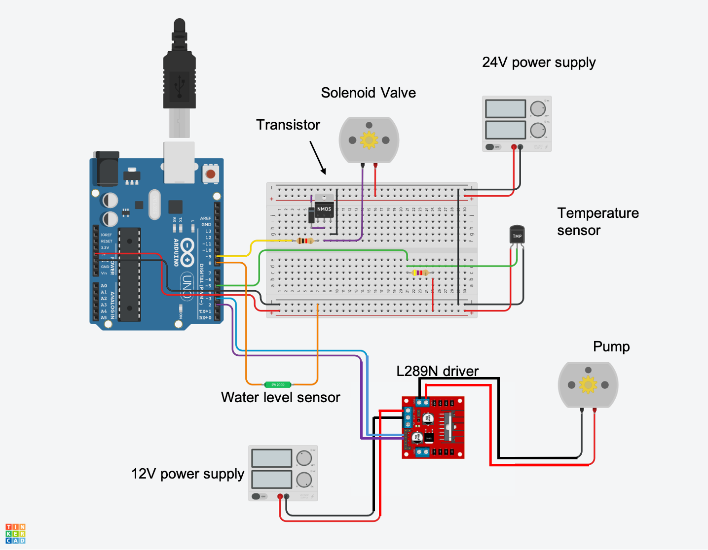

# Arduino code for PolyMersion experiments

This folder contains the Arduino code to run the Polymersion experiments with one or two water baths. 

The schematics for running with only one bath are presented in the following figure:

In case of using two water baths, you will need to install a new water level sensor, temperature sensor and add another pump to the free ports in the L289N driver. 

All Dallas Temperature sensors share the data transfer pin throught the One Wire protocol, and are differenciated by their address. This guide explains in detail the wiring and how to find the adress so it can be scales to multiple water baths.

To install the Arduino code in the board, use Arduino GUI or the Arduino CLI tool. The OneWire.h and DallasTemperature.h libraries are required.

The code serves three functions:
1. Refill each of the water baths when their corresponding floating switch detects that the water level is low.
2. Send the temperature sensors reading every time it receives a serial request (sent by the python code) to keep track of the temperature.
3. Open the compressed air valve to dry the specimens every time it's requested, again via serial.

The code is commented in detail so every function can be modified if needed to extend functionality or the number of water baths available.
